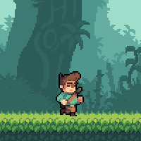

# Developer Diary

## Participants

Mario Nowak, Alexander Zeikowski, Wassim Ben Salem, Ayman El Ouariachi

## Link to the game

https://play.unity.com/mg/other/jungle-runner-2

## Task 1

### 1.1

First, we created a GitHub repository to collaboratively work on the project. Next, we installed Unity Hub and created a 2D project for our game using the 2D template. We went with editor version `2021.3.4f1` as it was the one used in the lecture videos. 

### 1.2

We found an asset pack called [Jungle Pack](https://jesse-m.itch.io/jungle-pack) on `itch.io` and imported the sprite sheets for the player character, background and terrain into our project. Next, we wanted to create a player game object with a walking animation. For that, we used the built-in sprite editor to slice the sprite sheet into individual frames. Then we dragged the frames into the editor, creating a run animation and an animation controller. Finally, we added an `Animator` component to the player game object and assigned the animation controller to it. With that, the player started playing the walking animation once we started the game (even though he didn't move yet).

We also needed assets for enemies and collectibles so we again went to `itch.io`. We found [Pixel Adventure 2](https://pixelfrog-assets.itch.io/pixel-adventure-2) which has plenty of sprites for different types of enemies.

Unfortunately, we couldn't recall the names of the other asset packs we used, but we only used very few assets from other packs.

### 1.3

In order to move the character, we created a `PlayerController.cs` script:

```cs
public class PlayerController : MonoBehaviour
{

    public Rigidbody2D Transform;
    public float MovementSpeed = 5;

    void Start()
    {
        Transform = GetComponent<Rigidbody2D>();
    }

    void Update()
    {
        Transform.velocity = new Vector2(MovementSpeed, 0);
    }
}
```

Over the course of development, this script changed dramatically but it's what we started with.
The script fetches the player character's `Rigidbody2D` component and sets its horizontal velocity to be a constant value greater zero. This way, the player character moves to the right.
Additionally, we constrained the the player character's movement by disabling rotation around the z-axis in the editor under the `Rigidbody2D` component.

### 1.4

To ensure that the camera is "following" the player, we gave it a `CameraFollow` script. The script takes in a transform and in every `Update` call, it sets it's own transform to the given one:

```cs
public class CameraFollow : MonoBehaviour
{
    public Transform followTransform;
    private Vector2 _cameraOffset;

    void Start()
    {
        this._cameraOffset = transform.position;
    }

    void Update()
    {
        this.transform.position = new Vector3(followTransform.position.x + this._cameraOffset.x , this._cameraOffset.y, this.transform.position.z);
    }
}
```

### 1.5

While implementing the player jump we realized that our way of moving the player may not be appropriate. We changed the movement to be handled in a `FixedUpdate` call via a `translate`:

```cs
void FixedUpdate()
{
    transform.Translate(new Vector3(movementSpeed * Time.fixedDeltaTime, 0, 0));
}
```

We used the `Update` method to check for user input:

```cs
void Update()
{
    if (Input.GetKeyDown(KeyCode.Space) && this._onGround)
    {
        this._rigidbody.AddForce(new Vector2(0, this._jumpForce), ForceMode2D.Impulse);
    } 
}
```

To prevent the player from jumping multiple times in the air, we added an extra condition that checks if the player is on the ground. At first, we just had a simple collision check with the ground. If the player collided with the ground, `_onGround` was set to true.

### 1.6

In this task we implemented the first immobile enemy, the rock:


We took the sprite sheet from the Pixel Adventure asset pack, sliced it into the individual frames using the build-in sprite editor and dragged the frames into the current scene. This created an animation as well as an animation controller. Next, we added a `RigidBody2D`, a `CapsuleCollider2D`, constrained the rotation around the z-axis, added the custom `Obstacle` tag and the custom `Obstacle.cs` script:

```cs
public class Obstacle : MonoBehaviour
{
    public delegate void GotTouchedByPlayer();
    public static event GotTouchedByPlayer OnGotTouchedByPlayer;

    void OnTriggerEnter2D(Collider2D other)
    {
        if(other.gameObject.tag == "Player") {
            OnGotTouchedByPlayer();
        }
    }

    void OnCollisionEnter2D(Collision2D other)
    {
        if (other.gameObject.tag == "Player") {
            OnGotTouchedByPlayer();
        }
    }
}
```

At this point, an obstacle does nothing more than checking if it collided with a player and emitting an event in that case. We will use this event later to end the game. Finally, we dragged the rock object into the file tree to transform it into a prefab.

### 1.7

First, we created an additional scene for the main menu, with three simple buttons: one to play the game, one to change volume settings and one to quit the game.


The main menu had a simple script with a `PlayGame()` function that used the built-in scene manager to load the main game scene. We connected the `OnClick()` event of the button in the editor to call that function to be able to start the game.

Next, we created two additional scenes, one for a win and one for a game over. Both scenes display a message (either "You Won!" or "Game Over!"), and an option to restart.

In order to end the game and transition into the game over scene, we added a `GameController` GameObject to our main game scene.

```cs
public class GameController : MonoBehaviour
{
    void Start()
    {
        Obstacle.OnGotTouchedByPlayer += EndGame;
        GoalDetection.OnGotTouchedByPlayer += EndGameWin;
    }

    void EndGame()
    {
        SceneManager.LoadScene("GameOverScene");
    }

    void EndGameWin()
    {
        SceneManager.LoadScene("VictoryScene");
    }
}
```

In this very first version, the game controller listens to the `OnGotTouchedByPlayer` event of all obstacles. If this event gets emitted, the game controller calls the `EndGame()` function and the game ends. We added a chest game object with the same event to check if the player successfully finished the level. 

### Additional Stuff for Task 1

One thing we haven't mentioned so far is the terrain on wich the player character moves. The Jungle Pack contains a set of tiles for terrain:


We only needed a subset of the tiles so we removed most of them resulting in these two smaller tilesets:


Drawing entire levels out of these individual tiles would be very cumbersome so we started looking for a way to automatically draw the right tiles based on their neighborhood. Unity does support drawing tiles on a grid out of the box, however there is no feature that enables autotiling. For that, we imported the `2D Tilemap Extras` package from the package manager. It allows us to create a tileset with extra rules to automatically determine, which tile to draw based on its neighbors:


Next, we needed to add collision to the tiles so that the player character would not fall through. For that, we added a `Tilemap Collider 2D` to the tilemap. This solved the collision problem but by default, the collider of a single tile is as big as the tile itself. This means the player walked on the very tip of the blades of grass. But looking on the example provided on the page of the asset pack, the player collides at a different height, making it look like the gras is slightly in the background:



To achieve the same effect, we needed find a way to slightly shrink the hitbox of all outer tiles. Luckily, Unity provides a feature for that. In the top left corner of the sprite editor, there is the option to switch to `Custom Physics Shape` mode. In that mode, the hitbox for every tile can be adjusted manually:


After adjusting the hitbox, the player would walk on the tiles just as in the example.

## Task 2

### 2.1

In order to keep track of the player's score, we created a `ScoreManager` game object as well as a `ScoreManager.cs` script:

```cs
public class ScoreManager : MonoBehaviour
{

    public float RunningScore;
    public float CollectibleScore;

    public Transform player;
    public float scoreMultiplier = 1;
    public float score
    {
        get => RunningScore + CollectibleScore;
    }
    

    // Update is called once per frame
    void Update()
    {
        this.RunningScore = player.position.x * scoreMultiplier;
    }

}
```

We split the score into two different parts, the `RunningScore` and the `CollectibleScore`.
The score manager gets a reference to the player via the editor and uses the player character's x-coordinate as the `RunningScore`. To get the overall score, we created a `score` property that adds the two individual scores together.

To display the score, we created a canvas which is attached to the main camera, and added a game object with a text component to it. This game object also received a script to display the score manager's score in every `Update()` call:

```cs
public class ScoreLabel : MonoBehaviour
{

    public ScoreManager score;
    private Text text;

    // Start is called before the first frame update
    void Start()
    {
        text = GetComponent<Text>();
    }

    // Update is called once per frame
    void Update()
    {
        text.text = "Score: " + (int) score.score;
    }
}
```

### 2.2

In order to persist the score between scenes and show it in the end scene, we created a static `Globals` class. If the game ends, the game controller stores the score in a static field of the `Globals` object:

```cs
// GameController.cs

void EndGame()
{
    Globals.score = this.ScoreManager.score;
    SceneManager.LoadScene("GameOverScene");
}   
```

The game over and victory scene both read the `Globals.score` value and then display it.

### 2.3

For the collectible, we decided to go with a red gem. A collectible is a game object with a `Collectible` tag, a `CapsuleCollider2D` (with `IsTrigger` being set to true) and a `Collectible.cs` script:

```cs
public class Collectible : MonoBehaviour
{
    public int points = 40;
    public delegate void GotTouchedByPlayer(int score);
    public static event GotTouchedByPlayer OnGotTouchedByPlayer;

    void OnTriggerEnter2D(Collider2D other)
    {
        if (other.gameObject.tag == "Player") {
            OnGotTouchedByPlayer(points);
            Destroy(gameObject);
        }
    }       
}
```

If the player walks into a collectible, it emits an event with the number of points to add to the score. Then it destroys itself. To increase the score, we let the game controller listen to that event:

```cs
// GameController.cs

void Start()
{
    Collectible.OnGotTouchedByPlayer += IncrementCollectibleScore;
    Obstacle.OnGotTouchedByPlayer += EndGame;
    GoalDetection.OnGotTouchedByPlayer += EndGameWin;
}

void IncrementCollectibleScore(int by)
{
    ScoreManager.CollectibleScore += (float) by;
}
```

### 2.4

#### Enemy with a random walking pattern

First, we picked one of the enemies from the Pixel Adventure pack. We decided to go with the slime enemy:


The process for creating the animation and game object was identical to that of the rock enemy except for the `RandomWalk.cs` script attached to the slime:

```cs
public class RandomWalk : MonoBehaviour
{

    public float movementSpeed = 2;
    public float MinimumTurningTime = 1;
    public float MaximumTurningTime = 3;
    private float _turningTime;

    void Start()
    {
        SetRandomTurningTime();
    }

    void FixedUpdate()
    {
        transform.Translate(new Vector3(-movementSpeed * Time.deltaTime, 0, 0));

        this._turningTime -= Time.fixedDeltaTime;
        if (this._turningTime < 0) {
            SetRandomTurningTime();
            TurnAround();
        }
    }

    void SetRandomTurningTime()
    {
        this._turningTime = Random.Range(MinimumTurningTime, MaximumTurningTime);
    }

    void TurnAround()
    {
            movementSpeed = -movementSpeed;
            this._spriteRenderer.flipX = !this._spriteRenderer.flipX;
    }
}
```

Objects with that script continue to walk in one direction, until a timer reaches zero. Then, the timer gets reset to a new random value ranging from [`MinimumTurningTime`, `MaximumTurningTime`], and the object turns around.

#### Enemy with a continuous walking pattern

For this enemy type we decided to go with the ghost:


Creating the ghost was almost identical to the slime except for two differences. For one, the movement scrip was simpler as it did not involve randomly switching directions. Secondly, the ghost does not have a `RigidBody2D` component in order to not get affected by gravity. It only has a `BoxCollider2D` with `IsTrigger` being set to true in the editor.

### Additional Stuff for Task 2

The very last task of the assignment is to extend the game with extra features. One visual feature we wanted to add was a parallax background. The Jungle Pack provides a set 5 different background layers which can be used for a parallax effect.

We began by creating the individual layers of the background. The `Wrap Mode` of each layer texture was set to "Repeat" in the inspector. Next, we created a game object with a sprite renderer for each layer. We set the `Draw Mode` to "Tiled" and increased the width to 200 units. This way, each layer would repeat to the left and right for a sufficiently long distance. Afterwards, each layer received the `ParallaxLayer.cs` script:

```cs
public class ParallaxLayer : MonoBehaviour
{

    public Camera MainCamera;
    public Transform subject;

    Vector2 startPosition;
    float startZ;

    Vector2 travel => (Vector2) MainCamera.transform.position - startPosition;
    
    float distanceFromSubject => transform.position.z - subject.position.z;
    
    float parallaxFactor => 3 * Mathf.Abs(distanceFromSubject) / (MainCamera.transform.position.z + MainCamera.farClipPlane);

    void Start()
    {
        startPosition = transform.position;
        startZ = transform.position.z;
    }

    void Update()
    {
        if (MainCamera != null)
        {
            Vector2 newPos = startPosition + travel * parallaxFactor;
            transform.position = new Vector3(newPos.x, newPos.y, startZ);
        }
    }
}
```

In short, this component computes a parallax factor based on the z-coordinates of the player character, the camera and the layer. Layers which are closer to the camera have a higher parallax factor and therefore move quicker, creating a parallax effect. The last thing left to do was to change the z-coordinates of all the layers. For that, we switched to the 3D view in the editor:


## Task 3

### 3.1

Our fist interactable was a plant that shoots bullets out of its mouth, similar to the plants in "Plants Vs Zombies":


We created an empty game object and gave it an animated sprite the same way we did it for the previous game objects. Next, we gave it a `BoxCollider2D` with `IsTrigger` being set to true. This collider determines if the player is close enough to the interactable for him to start loading it.
Afterwards, we gave the plant an `Interactable` tag and created a base `Interactable.cs` script:

```cs
public class Interactable : MonoBehaviour
{
    public delegate void PlayerInside(Interactable self);
    public static event PlayerInside OnPlayerInside;
    public delegate void PlayerExited(Interactable self);
    public static event PlayerExited OnPlayerExited;

    public float LoadingTime = 1;
    public float CurrentLoadingTime = 0;
    public bool Used = false;

    private bool _loading;

    void Update()
    {
        if (_loading) {
            CurrentLoadingTime += Time.deltaTime;
        }
    }

    void OnTriggerEnter2D(Collider2D other)
    {
        if (other.gameObject.tag == "Player")
        {
            OnPlayerInside(this);
        }
    }

    void OnTriggerExit2D(Collider2D other)
    {
        if (other.gameObject.tag == "Player")
        {
            OnPlayerExited(this);
            Trigger();
        }
    }

    public virtual void Activate()
    {
        // Hook Function
    }
    
    public void Load()
    {
        if (!Used)
        {
            _loading = true;
        }
    }

    public void Trigger()
    {
        _loading = false;
        if (CurrentLoadingTime > LoadingTime && !Used)
        {
            Activate();
            Used = true;
        }
        ResetLoadingTime();
    }

    private void ResetLoadingTime()
    {
        CurrentLoadingTime = 0;
    }

}
```

An "abstract" interactable supports the following functionality: Firstly, it detects whether the player character enters or exits the collider and emits an appropriate event. Additionally, it can be set into a loading state with the `Load` method. If an interactable is in said state, it starts a timer. If an interactable gets triggered via the `Trigger` method, it checks whether the timer is greater than some predefined threshold. If that's the case, it calls the virtual `Activate` method. Otherwise the timer gets reset to 0. A "concrete" interactable overrides the virtual `Activate` method, implementing the actual behavior of the interactable. Here is the `Plant.cs` script, which extends `Interactable`:

```cs
public class Plant : Interactable
{

    public GameObject BulletPrefab;
    private Transform _bulletStartingPosition;

    void Start()
    {
        _bulletStartingPosition = transform.Find("BulletOrigin");
    }

    public override void Activate()
    {
        Instantiate(BulletPrefab, _bulletStartingPosition.transform.position, Quaternion.identity);
    }
}
```

The `Plant` interactable has a single child game object which we used to determine, where the bullet should originate from. Inside its `Activate` method, it only instantiates a bullet prefab which was previously specified in the inspector. The bullet prefab is a game object which continuously moves to right and detects collisions with object with the `Obstacle` tag. A bullet destroys every obstacle it comes in contact with. Additionally, it destroys itself after a fixed time via a decrementing timer in the `FixedUpdate` loop:

```cs
public class Projectile : MonoBehaviour
{
    public float Speed = 3;
    public float LifeTime = 2;

    void FixedUpdate()
    {
        transform.Translate(new Vector3(Speed * Time.deltaTime, 0, 0));
        LifeTime -= Time.fixedDeltaTime;
        if (LifeTime < 0)
        {
            Destroy(this.gameObject);
        }
    }

    void OnTriggerEnter2D(Collider2D other)
    {
        if (other.gameObject.tag == "Obstacle")
        {
            other.gameObject.GetComponent<Obstacle>().Die();
            Destroy(this.gameObject);
        }
    }
}
```

At this point, the interactable itself is done but we still needed a way to charge it through user input. To achieve that, we let the player character check for collisions with interactables. If the player walks into an interactable, it stores a reference to it. Upon exiting, it drops that reference. Next, we changed the `Update` procedure of the player a little:

```cs
void Update()
{
    if (Input.GetKeyDown(KeyCode.Space))
    {
        if (_inInteractible && !_currentInteractable.Used)
        {
            startLoadingInteractable();
        }
        else
        {
            Jump();
        }
    }

    if (Input.GetKeyUp(KeyCode.Space))
    {
        if (_inInteractible)
        {
            _currentInteractable.Trigger();
        }
    }
}
```

If the user presses the space bar while he is on the ground and inside the interactable (and the interactable is not already used) he starts charging it:

```cs
void startLoadingInteractable()
{
    if (_onGround)
    {
        _currentInteractable.Load();
    }
}
```

If he releases the space bar, the interactable gets triggered.

The last thing we now need is to display a visual cue showing the charge of an interactable. We achieved that by adding a game object called `InteractableNotification` to the UI canvas layer. An `InteractableNotification` consists of a text and a progress bar. It listens to the `Interactable`'s `OnPlayerInside` and `OnPlayerExited` event. If the player walks into an interactable, the `InteractableNotification` stores a reference to that interactable and displays a text signalizing the player to start charging the interactable. If the player leaves the interactable, the text gets disabled. If the currently stored interactable has a `CurrentLoadingTime` greater 0, the `InteractableNotification` displays a progress bar on the lower portion of the screen:

```cs
// Snippet from InteractableNotification.cs

void Update()
{
    if (_hasInteractible)
    {
        if (_interactable.CurrentLoadingTime > 0)
        {
            _progressBar.gameObject.SetActive(true);
            _text.enabled = false;
            _progressBar.value = _interactable.CurrentLoadingTime;
        }
        else
        {
            _text.enabled = true;
            _progressBar.gameObject.SetActive(false);
        }
    }
}
```

We waited for task 5.2 before doing task 3.1.4 as we didn't have any real levels up to this point.

### 3.2

For our second interactable we decided to go with a lift which helps the player to reach high platforms. The lift consists only of a piece of terrain constructed from tiles. Since we already created an `Interactable` base class in the last sub-task, we only need to extend that base class and override the `Activate` method:

```cs
public class Lift : Interactable
{
    public float TransitionDuration = 1;
    private Vector3 _endPosition;

    void Start()
    {
       _endPosition = transform.Find("EndPosition").GetComponent<Transform>().position;
    }

    public override void Activate()
    {
        System.Action<ITween<Vector3>> updatePosition = (t) =>
        {
            gameObject.transform.position = t.CurrentValue;
        };
        gameObject.Tween("Move", transform.position, _endPosition, TransitionDuration, TweenScaleFunctions.CubicEaseInOut, updatePosition);
    }
}
```

In order to move the lift upwards, we used a tween library we found for free in the unity asset store. The tween interpolates the lift's position from its starting position to a target position in a fixed time. This was all we needed to implement the interactable.

## Task 4

### 4.1

For the shooting enemy, we chose the walking trunk:


It received the same movement script as the ghost enemy as well as `Trunk.cs` script:

```cs
public class Trunk : MonoBehaviour
{

    [SerializeField] GameObject _projectilePrefab;
    Detector _playerDetector;
    Transform _projectileOrigin;
    bool _shot = false;

    void Start()
    {
        _playerDetector = transform.Find("PlayerDetector").GetComponent<Detector>();
        _projectileOrigin = transform.Find("ProjectileOrigin").transform;

        _playerDetector.OnDetected += ShootProjectile;
    }

    void ShootProjectile()
    {
        if (!_shot)
        {
            Instantiate(_projectilePrefab, _projectileOrigin.position, Quaternion.identity);
            _shot = true;
        }
    }
}
```

The trunk enemy has two child game objects. The first one's only purpose is to determine where the trunk's projectile will be instantiated. The second one has a `BoxCollider2D` which detects the player. If the player walks into that collider, the trunk fires its projectile. The trunk's projectile is a small game object with the `Obstacle` component which moves to the left.

### 4.2

Our visual indicator for enemies is an exclamation mark in a box. We created one in a blue box (for stationary enemies), one in a yellow box (for moving enemies) and one in a red box (for shooting enemies):


Next we created a warning sign prefab game object for every color. Every warning sign starts to blink a couple of times once instantiated and then destroys itself. To spawn the signs, we added a `WarningSignSpawner` game object with a `BoxCollider2D` to the right of the camera:


Additionally, we added a new field to the `Obstacle` class, so that the appropriate warning sign could be configured for every enemy type:


If the `WarningSignSpawner` collides with an enemy off camera, it gets the warning sign prefab of that enemy and instantiates it as a child on screen at the same height as the enemy.

### 4.3

While implementing the double jump, we realized that our way of determining if the player character is on the ground had some issues. Since we only checked if the player was touching the ground (no matter the side), it was possible to touch the edge of a platform to jump multiple times (effectively doing something like a wall climb). To circumvent that, we decided to cast 2 short rays downward from the bottom side of the player to detect if he is grounded. Next, we changed the `Jump` method so that the player can jump if the number of jumps he performed is smaller than the maximum number of jumps he can do.

```cs
void Jump()
{
    if (currentJumps < MaxJumps)
    {
        if (!justJumped && _onGround)
        {
            justJumped = true;
        }
        float jumpMultiplier = currentJumps > 0 ? 0.5f : 1f;
        _rigidbody.AddForce(new Vector2(0, this._jumpForce * jumpMultiplier), ForceMode2D.Impulse);
        currentJumps = currentJumps + 1;
    }
}
```

Touching the ground resets the `currentJumps` counter to 0.

## Task 5

### 5.1

In order to create a sound whenever the player character is jumping or landing, we added two `AudioSource` components to it and store a reference to them via the editor:


Whenever the player jumps or lands we call the `Play()` method on the appropriate `AudioSource` component.

Because our game ends immediately when the player walks into an obstacle, we didn't add a sound when colliding with an enemy. Instead, we added a sound when an enemy gets destroyed by the bullet of the plant interactable. For that, we added a `AudioSource` component to all game objects with the `Obstacle` component and stored the reference to that `AudioSource` in the `Obstacle` just like we did for player character. Finally, if an obstacle gets destroyed by a bullet, we play the death sound. Creating the sound for collectibles works the exact same way as the two previous cases. 
To get a looping background music, we added a `BackgroundMusic` game object to the main game scene. This game object has an `AudioSource` component with the `PlayOnAwake` and `Loop` flags being set to true.

### 5.2

The first two levels we created are tutorial levels meant to slowly introduce the player to game mechanics. Thew following three levels build on the assumption that the player is familiar with the game mechanics and are therefore more difficult.

### 5.3

For the bonus features we decided to add more visual and auditorial effects rather than gameplay mechanics. As previously mentioned, we added a parallax background. We also added sound effects while an interactable is being charged. Additionally, the plant interactable creates a sound when shooting a bullet and the lift interactable makes a sound while ascending.
The player character received two sound effects for stepping onto grass. In every frame where he steps on the grass, a random one of the two sounds is picked and played. In our opinion, this creates a nice walking sound.
